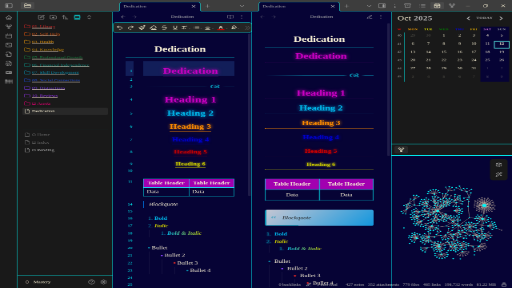

# Dedication Theme for Obsidian

A beautiful, highly customizable dark/light theme for Obsidian with extensive color customization options and elegant design features.

## ✨ Features

### 🎨 Comprehensive Color Customization
- **6 Beautiful Presets**: Dark Modern, Dracula, Nord, Gruvbox, Monokai, and Custom
- **Complete Color Control**: Customize every aspect of both dark and light themes
- **Adaptive Accent**: Automatically adjusts accent colors for optimal contrast
- **Individual Heading Colors**: Set unique colors for H1 through H6 headings

### 🖋️ Typography Options
- **Font Family Selection**: Choose from System UI, Roboto, Inter, Georgia Serif, Monospace, or Custom fonts
- **Adjustable Font Size**: Custom base font size
- **Line Height Control**: Perfect text readability

### 📁 File Explorer Enhancements
- **Rainbow Folders**: Color-coded folder hierarchy
- **Customizable Spacing**: Adjust folder indentation and item padding
- **Beautiful Icons**: Custom file and folder icons

### 🎯 Design Features
- **Centered Headers**: Beautiful centered headings with colored underlines
- **Modern Blockquotes**: Elegant styled quotations
- **Glowing Tables**: Enhanced table styling with accent colors
- **Round Checkboxes**: Stylish circular task items
- **Custom Calendar**: Colorful weekly calendar view

## 🚀 Installation

1. Open Obsidian Settings
2. Go to Appearance → Themes
3. Click "Manage" and search for "Dedication"
4. Select and apply the theme

## ⚙️ Customization

### Using Style Settings Plugin

For full customization, install the **Style Settings** plugin:

1. Go to Community Plugins → Browse
2. Search for "Style Settings"
3. Install and enable the plugin
4. Access customization options in Settings → Style Settings

### Available Customization Sections

#### Theme Presets
- Switch between pre-designed color schemes
- Custom preset for manual color configuration

#### Colors
- **Dark Theme**: Primary/secondary backgrounds, text colors
- **Light Theme**: Primary/secondary backgrounds, text colors  
- **Accent Colors**: Main accent, hover states, border colors
- **Heading Colors**: Individual colors for H1-H6

#### Typography
- Font family selection
- Base font size (px)
- Line height multiplier

#### Layout
- Sidebar width
- Content max width

#### File Explorer
- Rainbow folders toggle
- Folder indentation
- Item vertical padding

## 🎨 Color Presets

### Dark Modern
- Deep blue backgrounds with bright accent colors
- Modern, professional appearance

### Dracula
- Purple-based theme inspired by Dracula color scheme
- High contrast and vibrant

### Nord
- Arctic, north-bluish color palette
- Calm and focused

### Gruvbox
- Retro groove color scheme
- Warm and comfortable

### Monokai
- Classic Monokai-inspired colors
- Vibrant and energetic

## 🤝 Contributing

Found a bug or have a feature request? Please open an issue on GitHub.

## 📄 License

This theme is released under the MIT License.

## 🙏 Acknowledgments

- Inspired by various modern design systems
- Community feedback and contributions
- Obsidian team for the amazing platform

---

**Enjoy using Dedication Theme?** Consider starring the repository and sharing it with other Obsidian users!
